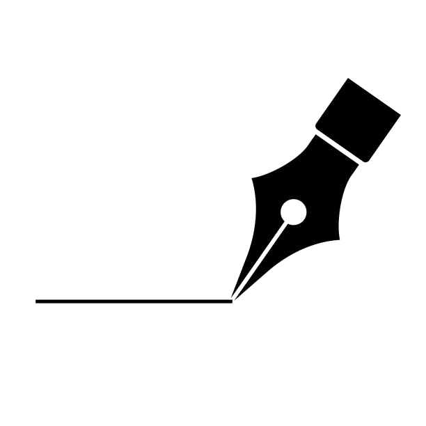

<div align="center">
  

  # ✨ Andraw

  **A beautiful, local drawing app with hand-drawn aesthetic**

  Create stunning diagrams with comprehensive AWS architecture templates

  
  
  
  

</div>

---

## 📸 Preview

<div align="center">
  <p><i>🎨 Create beautiful hand-drawn diagrams with AWS architecture templates</i></p>
  <p><i>💡 Tip: Try opening index.html to see Andraw in action!</i></p>
</div>

---

## 📋 Table of Contents

- [✨ Features](#-features)
- [🚀 Quick Start](#-quick-start)
- [🎮 How to Use](#-how-to-use)
- [📖 What's New](#-whats-new)
- [🏗️ Development Journey](#️-development-journey)
- [🛠️ Technical Stack](#️-technical-stack)
- [📜 License](#-license)

---

## ✨ Features

### 🎨 Drawing Tools
- **7 Shape Types**: Rectangle, Circle, Diamond, Parallelogram, Rounded Rectangle, Triangle, plus custom shapes
- **Drawing Tools**: Line, Arrow, Pen (freehand), Text
- **Hand-drawn Style**: Rough, sketchy aesthetic inspired by Excalidraw
- **Auto Text Labels**: Automatically prompts for text with smart incrementing ("Thing 1", "Thing 2"...)

### 🎯 Selection & Manipulation
- **Smart Selection**: Click to select, drag to move, corner handles to resize
- **Multi-Select**: Drag to select multiple elements at once
- **Connect Mode** (`C`): Drag a rectangle to auto-connect elements with arrows
- **Arrow Key Positioning**: Fine-tune with 1px or 10px (with Shift) precision
- **Copy/Paste/Duplicate**: Full support with parent-child relationship preservation

### 🎨 Customization
- **Colors**: Stroke color, fill color, background color - all customizable in real-time
- **14 Font Choices**: From classic to modern typefaces
- **Line Styles**: Solid, dashed, or dotted lines
- **Line Routing**: Straight or stepped (orthogonal) connectors
- **Style Presets**: Quick-apply preset styles to your elements

### 📐 Advanced Features
- **Grid & Snap**: Toggle grid (`G`) and snap to grid (`Shift+G`)
- **Alignment Tools**: Left, Center, Right, Top, Middle, Bottom with smart text handling
- **Distribution**: Horizontal and vertical distribution maintaining relative positions
- **Zoom Controls**: Fit, Reset, 50%, 100%, 150%, 200%
- **Lock/Unlock**: Prevent accidental edits to specific elements

### 📦 Rich Template Library

#### 📊 Flowchart
Process, Decision, Data, Terminator, Document

#### 🏗️ UML
Class, Actor, Package

#### ☁️ Cloud
Server, Database, Cloud, Lambda, Storage, Queue

#### ⚡ AWS (44 Services Across 9 Categories)
- **Compute**: EC2, Lambda, ECS, Fargate, Batch
- **Storage**: S3, EFS, Glacier, Storage Gateway
- **Database**: RDS, DynamoDB, ElastiCache, Redshift, Neptune
- **Networking**: VPC, CloudFront, Route53, API Gateway, Direct Connect
- **Security**: IAM, Cognito, Secrets Manager, Shield, WAF
- **Developer Tools**: CodeBuild, CodeDeploy, CodePipeline
- **Integration**: SNS, SQS, EventBridge, Step Functions
- **Analytics & ML**: Athena, EMR, Kinesis, SageMaker
- **Management**: CloudWatch, CloudFormation, Systems Manager

#### 🔷 Shapes
Hexagon, Triangle, Star, Note, Cylinder

#### 🌐 Network
Router, Firewall, Switch

### 💾 Export & Import
- **Image Export**: PNG, JPG, SVG (with embedded fonts)
- **JSON Export**: Save and load your work for later editing
- **Browser Storage**: Quick save/load from local browser storage

### ⌨️ Keyboard Shortcuts
| Key | Action |
|-----|--------|
| `V` | Selection tool |
| `R` | Rectangle (opens shape selector) |
| `C` | Connect mode |
| `L` | Line |
| `A` | Arrow |
| `P` | Pen |
| `T` | Text |
| `H` | Hand/Pan tool |
| `G` | Toggle grid |
| `Shift+G` | Snap to grid |
| `Cmd/Ctrl+C` | Copy |
| `Cmd/Ctrl+V` | Paste |
| `Cmd/Ctrl+D` | Duplicate |
| `Delete/Backspace` | Delete selected |
| `Arrow keys` | Move 1px (10px with Shift) |
| `?` | Show help |

## 🚀 Quick Start

### Running Locally

```bash
# Clone the repository
git clone https://github.com/DataVisuals/andraw.git
cd andraw

# Option 1: Open directly in browser
open index.html

# Option 2: Run with Python server (recommended)
python3 -m http.server 8000
# Then visit http://localhost:8000
```

### Getting Started

1. **🎨 Choose a tool** from the toolbar or press a keyboard shortcut
2. **✏️ Draw on canvas** by clicking and dragging
3. **📦 Add templates** from the collapsible left panel
4. **🎯 Select and customize** elements with the selection tool (`V`)
5. **💾 Export** your work as PNG, JPG, SVG, or save as JSON

## 🎮 How to Use

| Action | How To |
|--------|--------|
| **Draw Shapes** | Select a shape tool, click and drag on canvas |
| **Add Templates** | Click any template in the left panel - appears at canvas center |
| **Add Text** | Press `T`, click on canvas, type, and press Enter |
| **Move Elements** | Select with `V` tool, then drag |
| **Resize** | Select element and drag corner handles |
| **Connect Elements** | Press `C`, drag rectangle around elements to auto-connect |
| **Delete** | Select element(s) and press Delete/Backspace |
| **Customize Colors** | Select element, use color pickers in toolbar |
| **Apply Styles** | Select element, choose from style preset dropdown |

## 📖 What's New

### 2025-10-19
✨ Intelligent arrow routing with stepped path obstacle detection
✨ BOTTOM→BOTTOM fallback routing for nearly-aligned shapes with blocked paths
✨ Comprehensive test suite (90+ tests) for arrow routing edge cases
✨ Fixed arrows routing through obstacles when shapes are nearly horizontally aligned

### 2025-10-06
✨ Font Awesome icon library - searchable selector with 60+ popular icons
✨ Icons are resizable, moveable, and color customizable
✨ Unified shape selector with all shapes and keyboard shortcuts (Shift+1-7)
✨ Style preset selector reorganized into 4-column grid layout

### 2025-10-05
✨ Grid toggle (`G`) and snap to grid (`Shift+G`)
✨ Copy/paste/duplicate (`Cmd+C/V/D`) with parent-child preservation
✨ Alignment tools (left/center/right/top/middle/bottom) with smart text handling
✨ Distribution tools (horizontal/vertical) maintaining text relative positions
✨ Zoom controls (Fit/Reset/50%/100%/150%/200%)
✨ Selection tools (Select All, Lock/Unlock, Select by Type)
✨ Arrow key positioning (1px or 10px with Shift)
✨ Layout buttons now preserve selection
✨ Fixed copy/paste keyboard shortcuts
✨ What's New changelog panel (⭐ button)

### 2025-10-04
✨ New selection icons and improved styling
✨ Logo and visual enhancements

### 2025-10-03
✨ Comprehensive style preset system
✨ 14 font choices with live preview

### 2025-10-02
✨ Official AWS Architecture Icons integration (44 services, 9 categories)
✨ Collapsible template categories with visual previews
✨ Hand-drawn aesthetic inspired by Excalidraw
✨ Pan and zoom for infinite canvas

---

## 🏗️ Development Journey

Built iteratively with **Claude Code**, this project evolved through collaborative AI-assisted development:

### 🎯 Phase 1: Foundation
- Hand-drawn aesthetic with canvas-based rendering
- Template system with collapsible categories
- Smart arrow snapping to shape edges
- Live color editing for selected elements
- Multi-format export (PNG, JPG, SVG)

### ☁️ Phase 2: AWS Integration
- Official AWS Architecture Icons (44 services)
- 9-category hierarchical organization
- Icon text positioning optimization
- Local SVG asset hosting

### ⚡ Phase 3: Advanced Features
- Stepped/orthogonal connector routing
- 3-segment path algorithm for clean diagrams
- SVG export with proper arrowhead orientation
- Consistent toolbar UI/UX

### 🎨 Phase 4: Polish & Productivity
- Grid and snap functionality
- Alignment and distribution tools
- Copy/paste with relationship preservation
- Keyboard shortcuts for power users
- Style presets for rapid prototyping

## 🛠️ Technical Stack

<table>
<tr>
<td width="50%">

**Core Technologies**
- 🟨 Vanilla JavaScript (ES6+)
- 🎨 HTML5 Canvas API
- 💅 CSS3 with custom properties
- 📦 No build tools required

</td>
<td width="50%">

**Libraries & Assets**
- ⚡ Font Awesome 6.4.0
- ☁️ Official AWS Architecture Icons
- 🖼️ Custom SVG generation
- 💾 LocalStorage API

</td>
</tr>
</table>

**Key Features:**
- ✅ Zero dependencies - runs entirely in browser
- ✅ No backend required - fully client-side
- ✅ Offline capable after first load
- ✅ Cross-platform compatible

## 📜 License

Created with 🤖 **Claude Code** by Anthropic

---

<div align="center">

  **[⭐ Star on GitHub](https://github.com/DataVisuals/andraw)** | **[🐛 Report Bug](https://github.com/DataVisuals/andraw/issues)** | **[💡 Request Feature](https://github.com/DataVisuals/andraw/issues)**

  Made with ❤️ by [Andrew Spruce](https://github.com/DataVisuals)

</div>
